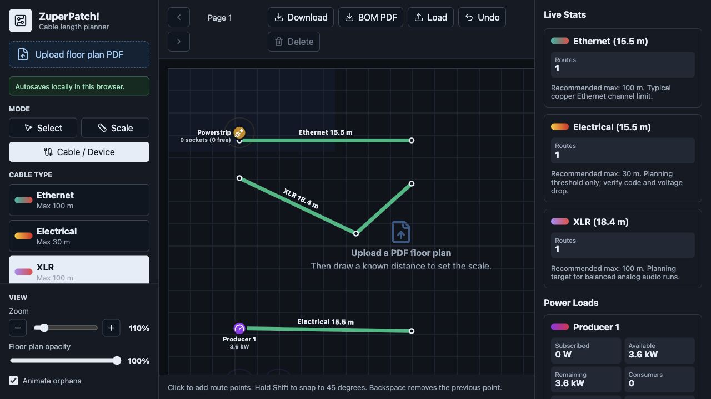
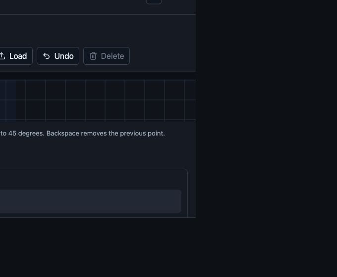
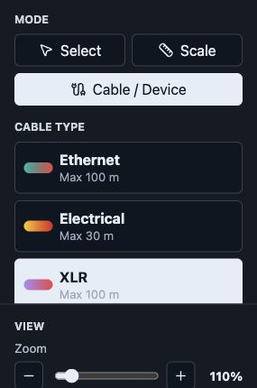
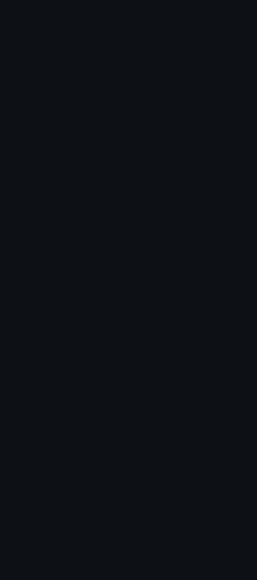

# ZuperPatch!

Préparer le câblage avant d’arriver sur site.

L’application transforme un plan de salle en espace de travail exploitable: on importe le plan, on fixe l’échelle, on trace les câbles, on place les équipements, puis on obtient les longueurs et le matériel nécessaire.



## Le problème

Un plan technique finit souvent éparpillé entre un PDF annoté, quelques mesures approximatives, un tableur de matériel et des discussions de dernière minute.

Ici, tout reste au même endroit:

- le plan
- les câbles
- les équipements
- les capacités
- les charges
- la liste de matériel

Le résultat attendu est concret: moins d’oublis, des longueurs plus fiables, et une préparation plus facile à relire avec l’équipe.

## Le flux de travail

### 1. Importer le plan

Le plan PDF sert de fond de travail. Son opacité peut être ajustée pour garder les tracés lisibles, et le mode sombre inverse le rendu du plan pour conserver du contraste.

### 2. Fixer l’échelle

On trace une distance connue, on indique sa longueur réelle, et toutes les longueurs de câbles sont calculées à partir de cette référence.

C’est ce qui permet de passer d’un dessin visuel à une estimation exploitable.

### 3. Tracer les câbles

Trois familles sont disponibles pour le moment:

- Ethernet
- Électrique
- XLR

Chaque famille porte sa longueur maximale recommandée. Les tracés restent lisibles sur le plan et les longueurs se mettent à jour pendant le dessin.



### 4. Placer les équipements

Le plan peut recevoir les éléments utiles à une installation terrain:

- sources électriques
- multiprises
- switches Ethernet
- clients Ethernet
- consommateurs électriques

Chaque équipement peut porter les informations qui comptent vraiment: nom, puissance disponible, puissance consommée, nombre de prises ou de ports, besoin PoE, position du libellé.



### 5. Vérifier les raccordements

Le dessin n’est pas seulement graphique. Les connexions gardent une logique métier:

- un consommateur électrique ne peut pas être alimenté deux fois
- un client Ethernet se raccorde à un switch
- une source ou un switch peut avoir une capacité limitée
- une multiprise suit ses prises occupées et ses prises libres souhaitées
- un besoin PoE remonte vers le switch concerné

Les équipements non raccordés peuvent être animés pour attirer l’attention sur ce qui reste à traiter.

### 6. Lire les stats en direct

La barre de droite donne une lecture immédiate du plan:

- longueur totale par type de câble
- nombre de routes
- longueur maximale recommandée
- souscription électrique
- charge PoE
- capacité de prises et de ports



### 7. Sortir la nomenclature

Le bouton `BOM PDF` génère une liste de matériel téléchargeable.

La nomenclature détaille les équipements et chaque câble individuel avec sa longueur requise. Les familles de câbles sont regroupées avec les mêmes couleurs que dans l’interface pour rendre le document lisible hors de l’outil.

## Confort de dessin

Le planificateur reprend les gestes attendus dans un outil de dessin:

- `Shift` pour contraindre les câbles à 45 degrés
- points intermédiaires éditables
- suppression des points ou câbles sélectionnés
- déplacement d’un équipement avec ses câbles attachés
- détachement d’une extrémité de câble depuis sa poignée
- barre d’espace pour passer temporairement en main et déplacer la vue
- zoom jusqu’à 500 %
- restauration automatique du zoom, de la position et du projet

## Sauvegarde et reprise

Le travail est sauvegardé automatiquement dans le navigateur.

On peut aussi télécharger un fichier projet et le recharger plus tard pour archiver une version, transférer une préparation, ou reprendre le plan depuis un autre poste.

## Pour qui

Cet outil vise les équipes qui préparent des installations techniques avant intervention:

- événementiel
- audiovisuel
- réseau temporaire
- salles de réunion
- plateaux
- espaces techniques
- déploiements ponctuels

Il ne remplace pas une validation réglementaire, mais il donne une base de préparation claire: ce qui est prévu, ce qui est raccordé, ce qui manque, et ce qu’il faut apporter.

## Développement

```bash
npm install
npm run dev
```

Vérification de production:

```bash
npm run lint
npm run build
```
